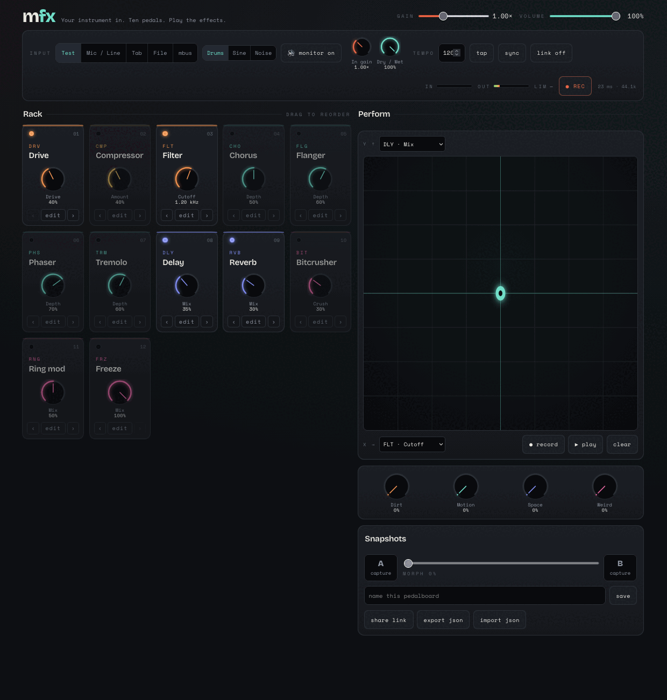

<div align="center">

# mfx

*Your instrument in. Twenty-five pedals. Play the effects.*

[](./package.json)
[](./LICENSE)
[](#verification)
[](./tsconfig.json)
[](https://react.dev)
[](https://vite.dev)
[](https://developer.mozilla.org/docs/Web/API/AudioWorklet)
[](#progressive-web-app)



</div>

mfx is a free, local-first **browser effects lab** where you perform the effects — plug a line in, drop in a loop or file, capture a browser tab, or pull a sibling instrument off the mbus, then engage the rack and ride the pedals. Twenty-five pedals, an XY performance pad, wet sends, reamping, resampling, and 24-bit WAV capture. No account, no upload, no gear beyond what's on your desk.

> **Latency & live use.** Running through the browser's audio graph adds roughly **10–30 ms** of round-trip latency (hardware buffer + `baseLatency` + `outputLatency`) — a platform floor no web app can beat, and mfx shows the reported figure live with a plain-language read on what it's good for. So mfx isn't a zero-latency guitar amp: for a live performer, monitor the **dry** signal through your interface's direct/hardware monitoring and let mfx add the **wet** on top. Everywhere latency doesn't reach a live player — loops, files, tab audio, mbus sources, reamping, and production — it runs as tight as any tool.

**Best for**

- **Wet sends & reamping** — monitor your dry signal through hardware; let mfx add the wet or re-process a recorded take.
- **Loops, files & browser-tab audio** — process, mangle, and resample with no live-monitoring cost.
- **mbus sources** — space and send effects for a sibling m-suite instrument over the local link-bridge.
- **Sound design & production** — 25 pedals, an XY pad, macros, and 24-bit WAV capture.

**Not a replacement for**

- A zero-latency guitar amp or hardware pedalboard for *live monitoring* — the browser round-trip is a platform floor no web app can beat.
- Your interface's direct/hardware monitoring when tracking a live performer through the app as their main monitor.

### ▶ Play it live → [mfx.mpump.live](https://mfx.mpump.live)

## Highlights

- **25-pedal reorderable rack** across eight families:
  - *Core* — Drive (7 voices incl. tube, tape, fuzz, fold), Filter (SVF / ladder / diode / comb models with drive)
  - *Studio* — Compressor (peak/RMS, lookahead, parallel), Imager (M/S width, rotation, mono-safe bass)
  - *Modulation* — Chorus (classic / dimension / ensemble), Flanger (with through-zero), Phaser (4/8/12 stage), Tremolo (classic / harmonic / auto-pan)
  - *Delay* — Delay (ping-pong, reverse, ducking, tempo sync), Tape Delay (wow/flutter, tape age, self-oscillation), Particle (granular echoes)
  - *Ambient* — Reverb (room / hall / plate / spring / diffuse / ambient), Shimmer, Cloud (cinematic diffusion with bloom + freeze), Bloom (input-reactive evolving pad)
  - *Spectral* — Pitch/Harmonizer, Spectral Freeze (FFT hold, smear, tilt, motion)
  - *Creative* — Freeze, Mosaic (granular texture engine), Fracture (tempo-aware micro-slicer), Resonator (string / bar / tube / metal bodies)
  - *Character* — Saturation (tape / tube / transformer / console), Bitcrusher, Codec (lo-fi codec artifacts — masking, warble, dropouts), Ring mod (free / note / pitch-tracked)

  Drag to reorder, click the LED to bypass (click-free crossfade), dial each in with an amount ring and a live animated SVG response visual.
- **Play the effects** — a large KAOS-style XY pad with assignable X/Y targets anywhere in the rack, one-lane gesture record/replay, and 4 macro knobs (Dirt · Motion · Space · Weird) that each sweep a curated multi-effect group.
- **Starter presets** — curated boards for guitar, synth, drums, vocals, drones, subtle production, ambient textures, and experimental sound design, plus browser-latency-safe starting points: wet-send ambience, reamp grit, loop mangler, tab polish, and mbus space.
- **Real inputs** — microphone / line-in (echo-cancellation, AGC, and noise-suppression off), browser-tab audio capture, an audio-file loop, and a built-in test source so you can play the rack with no gear.
- **Chain I/O** — input gain with peak meters and a low-signal hint, a master dry/wet with **Wet / Wet + dry / Muted** monitor modes for latency-safe workflows, an always-last output limiter, and master record-to-WAV at 24-bit with a live timer.
- **Snapshots** — A/B chains with click-free morph, named pedalboards in IndexedDB, JSON import/export, and share-a-board-via-URL links.
- **Tempo** — tap tempo plus optional Ableton Link tempo-follow via the mpump link-bridge, degrading gracefully to "searching…" when absent.
- **mbus input** — select the "mbus" input to subscribe to a sibling instrument's published output over the local link-bridge (tab-to-tab WebRTC, peer-to-peer); a picker lists the advertised sources, and the option stays silent and harmless when the bridge is absent.
- **Allocation-free DSP** — every effect is a pure, framework-free DSP core running in an AudioWorklet, unit-testable in plain Node.
- **Private by design** — no cookies, no telemetry, no uploads. Installable PWA, offline after the first visit.

## Run locally

Prerequisites: **Node 20+** and a Chromium-based browser (recommended).

```bash
npm install
npm run dev        # Vite dev server → http://localhost:5173
```

## Scripts

| Script | Description |
| --- | --- |
| `npm run dev` | Start the Vite dev server with HMR. |
| `npm run build` | Type-check the project references, then build the production bundle. |
| `npm run typecheck` | Type-check with `tsc -b` (no emit). |
| `npm run test` | Run the Vitest suite once. |
| `npm run test:watch` | Run Vitest in watch mode. |
| `npm run lint` | Lint the codebase with ESLint. |
| `npm run check` | Full gate: lint + typecheck + test + production build. |
| `npm run preview` | Serve the built bundle locally. |

## Controls

1. **Pick an input** — mic / line-in, tab capture (Chromium desktop), a file loop, an mbus source, or the built-in test source. Audio only starts on your gesture, and monitoring defaults to **Muted** for mic input.
   - **Choose a Monitor mode** — **Wet** (100% processed out; monitor your dry signal through hardware and use mfx as a send / reamp), **Wet + dry** (a blend, for production and file / tab / loop work), or **Muted** (silence to the speakers — recording still captures). The latency readout shows a plain-language read on what the current round-trip is good for.
2. **Engage pedals** — click a slot's LED to bring it in, open its modal to set the amount and per-effect params, and **drag slots to reorder** the signal chain.
3. **Perform** — sweep the **XY pad** (assign its X and Y to any params), record and replay a gesture lane, and ride the **macro knobs** for whole-rack moves.
4. **Snapshot** — capture A and B chains and morph between them click-free, name and save boards to IndexedDB, or share one via a URL link.
5. **Record** — arm master record-to-WAV (24-bit) and watch the live timer; the output limiter is always last in the chain.

## Architecture

```text
  main-thread UI (React)
        │
        │  postMessage(RackState)          modulation (macros + XY)
        ▼                                  resolved on the main thread
  AudioEngine ──────────────────────▶ mfx-rack AudioWorklet
        ▲                                  │
        │  postMessage(MeterMessage)       ▼
        │  (in/out peak, gain reduction)   pure DSP cores, in rack order
        │                                  │  drive → filter → … → freeze
        └──────────────────────────────── │
                                           ▼
                              native output limiter
                                           │
                          ┌────────────────┼────────────────┐
                          ▼                                  ▼
                    recorder tap                        destination
                    (WAV, 24-bit)                       (your speakers)
```

- **Pure DSP cores.** Each effect is a framework-free, allocation-free core that only touches sample buffers — so it runs in the AudioWorklet render loop and is exercised directly in Node tests.
- **Modulation on the main thread.** Macros and the XY pad are resolved to concrete param values before crossing the boundary; the worklet only ever receives a flat, ready-to-run `RackState`.
- **`contracts.ts` is the single source of truth.** It owns the effect registry (param specs + ranges), the canonical `Patch`, the frozen `DEFAULT_PATCH`, and the typed message unions crossing the main-thread ↔ worklet boundary.
- **Trust boundary.** Every value from an untrusted source — IndexedDB, a share-link URL fragment, worklet messages, Ableton Link — passes through `sanitizePatch`, which never throws and clamps every field to its declared range. DSP cores additionally guard with `Number.isFinite`.

## Verification

```bash
npm run check   # lint + typecheck + 396 tests + production build
```

The Vitest suite covers the parts that can be pinned down deterministically: the pure DSP cores, chain-order and modulation math, morph interpolation, preset validation/migration (`sanitizePatch`), and the WAV encoder. Live audio, input capture, and feedback behavior can't be asserted in a headless test — they live on the manual QA checklist below.

## Physical-device QA checklist

- [ ] **Mic / line, wet-only** — monitor the dry signal through your interface's direct/hardware monitoring; set Monitor to **Wet** and confirm only the processed signal returns from mfx, with no feedback.
- [ ] **File loop** — an audio file plays, loops cleanly, and processes through the rack.
- [ ] **Tab capture** — browser-tab audio is captured and processed (Chromium desktop).
- [ ] **mbus input** — a sibling instrument's published output is discovered and processed via the link-bridge.
- [ ] **WAV recording** — master record produces a valid, openable 24-bit WAV (including with monitoring muted).
- [ ] **Latency readout** — the estimate and its guidance label read sensibly on a wired input, and a high-latency (e.g. Bluetooth) output surfaces the "avoid live monitoring" guidance.
- [ ] Ableton Link follows mpump tempo via the link-bridge.

## Privacy

mfx is local-first. No account, no cookies, no telemetry, no uploads — audio never leaves your machine. Presets live in your browser's IndexedDB, and state is shared only via a URL fragment when you choose to share it.

## Browser notes & limitations

- **Chromium recommended.** Use a wired input for the best latency.
- **Tab capture is Chromium-desktop only.** `getDisplayMedia` audio is unsupported or unreliable on Safari and Firefox.
- **Real latency.** mfx displays the measured round-trip estimate with a plain-language read on what it's good for (tight · playable · production · avoid), and hints when an unusually high figure looks like a Bluetooth output. This is a performance effect, not a zero-latency guitar amp — for live playing, monitor dry through hardware and use mfx as a wet send / reamp. Use headphones; the start screen sets expectations before audio begins.
- **User gesture required.** Audio starts only on an explicit gesture, and mic monitoring defaults to Muted to protect against feedback.
- **mbus input needs the link-bridge.** Like Ableton Link tempo-follow, the mbus input relies on the local mpump link-bridge to discover sibling sources; without it the picker finds nothing and the input stays silent.

## Progressive Web App

mfx is an installable PWA with a hand-rolled service worker: network-first navigation, precached hashed assets, and full offline use after one visit.

## Native companion (optional, low-latency)

The browser round-trip is a ~10–30 ms platform floor no web app can beat. For musicians who
want hardware-pedal latency, mfx has an **optional native companion** — a small, headless local
process (Rust + [`cpal`](https://crates.io/crates/cpal)) that runs a low-latency CoreAudio I/O
engine and is controlled from the mfx transport bar over localhost.

- **The browser app stays canonical.** Native mode is an *optional, additive subset* — the
  browser engine, UI, presets, and sharing are unchanged. You switch the transport's **Engine**
  toggle to *Native* to stream the supported patch subset to the companion; *Browser* is the
  default and always available.
- **Subset, not parity.** The MVP ports six effects (drive, filter, compressor, delay, tremolo,
  reverb) plus an always-last safety limiter — not all 25 pedals. Parity is deliberately future
  work.
- **Loopback only.** The companion binds `127.0.0.1` — no LAN exposure, no remote control.
- **Status:** macOS-first and **experimental** — the audio path is implemented and unit-tested,
  but on-device audio + latency measurement is still pending (it makes no measured-latency claim
  it hasn't verified). See [`native-companion/`](./native-companion/) and its
  [design doc](./docs/native-companion-design.md) for build/run instructions, the protocol, the
  on-device QA checklist, and the full list of what's deferred.
- **Prebuilt binaries.** Download the companion for your platform from the
  [releases page](https://github.com/gdamdam/mfx/releases), or build it from source per the
  instructions above.

Without the companion running, mfx behaves exactly as before: the Native toggle simply reports
"companion not found" and nothing changes.

## Family

Part of the **m-suite** — [mpump](https://mpump.live), mloop, mdrone, mchord, mgrains, mspectr, mscope, and mfx.

## License

[AGPL-3.0-or-later](./LICENSE).
